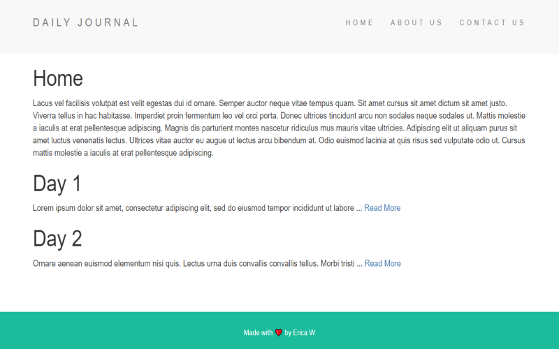
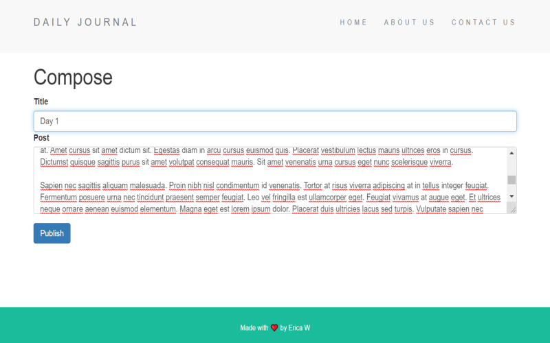

<h1 style="font-weight: bold;">Blog Site</h1>
<h3>A simple blog site where you can post content and recieve informative tidbits.</h3>

<h2 style="font-weight: bold;">Prerequisites</h2>

<a href="https://nodejs.org/en/docs/">▶ </a>Node.JS with Express.JS

<a href="https://docs.npmjs.com/">▶ </a>NPM Packages: Body Parser
 

<h2 style="font-weight: bold;">Versioning</h2>

Git Version Control

<h2 style="font-weight: bold;">License</h2>

This project is licensed under the MIT License - see the LICENSE.md file for details

